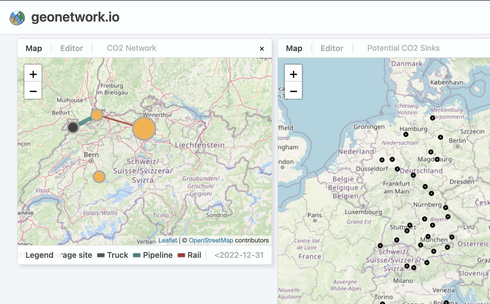

# Geonetwork

Geonetwork is a open-source visualization tool for geographical and time-dependent networks.

[Dashboard](https://geonetwork.io) | [Specification](https://github.com/c-jordi/geonetwork/wiki/Schema-(latest)) | [Wiki](https://github.com/c-jordi/geonetwork/wiki)

---

## Preview

</img>

## Author

This tool was developed by Jordi Campos during his time at the RRE Lab at ETH Zurich.
